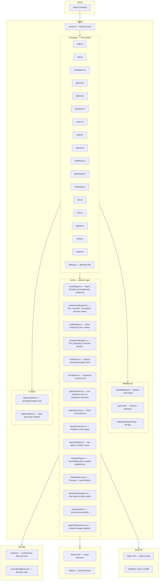

# HempForge — Architecture

## Module map

## Output classification

Every AI or computed output carries an explicit `outputClassification` field:

| Value | Meaning |
|---|---|
| `live-ai-inference` | Real model call completed successfully |
| `heuristic-fallback` | Rule-based computation, no live model |
| `deterministic-formula` | Pure math (Arrhenius, THC threshold) |
| `simulated` | Explicitly mocked — dev/test only |
| `demo-only` | Seeded fixture data — never production |

## Auth model

- All protected routes require `Authorization: Bearer <token>`
- Production: Firebase ID token with `tenantId` + `role` custom claims required
- Dev/test: `Bearer dev-<uid>:<email>:<tenantId>:<role>` — blocked in `NODE_ENV=production`
- Elevated roles for privileged operations: `Lab Admin`, `Quality Auditor`
- MFA: required for `Lab Admin` and `Quality Auditor` in production (Firebase MFA policy)

## Environment variables

| Variable | Required in prod | Purpose |
|---|---|---|
| `FIREBASE_PROJECT_ID` | ✅ | Firebase project |
| `FIREBASE_SERVICE_ACCOUNT_JSON` | ✅ | Admin SDK credentials |
| `COA_SIGNING_SECRET` | ✅ | HMAC key for COA signatures (min 32 chars) |
| `CORS_ORIGIN` | ✅ | Comma-separated allowed origins |
| `GEMINI_API_KEY` | Recommended | Gemini live inference |
| `METRC_API_KEY` | For live Metrc | Metrc vendor+user key (base64) |
| `METRC_BASE_URL` | For live Metrc | e.g. `https://api-nc.metrc.com` |
| `METRC_LICENSE_NUMBER` | For live Metrc | NC hemp license number |
| `USE_LOCAL_DB_FALLBACK` | Dev/test only | Bypasses Firestore |
| `NODE_ENV` | Always | `production` / `test` / `development` |

## Known gaps (v0.1.0)

- Real Metrc credentials not yet provisioned for production tenant
- MFA not yet enforced at the Firebase Console policy level
- No external penetration test completed
- E2E Playwright suite covers happy path only
